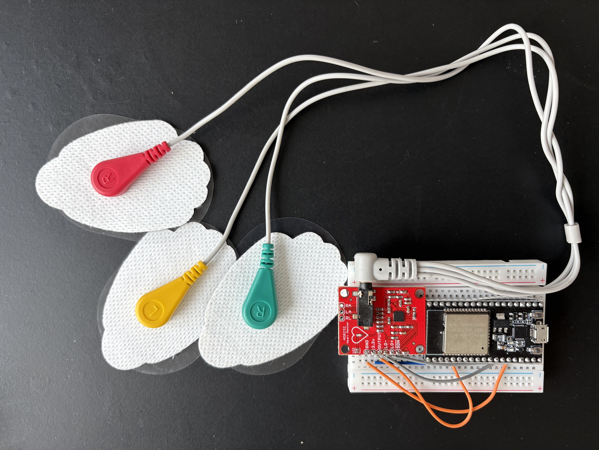

# Open-Source ECG Monitor
# About this Project

This project focuses on developing a portable, battery-operated heart rate monitor using an ESP32 and AD8232 ECG analog front-end (AFE) for real-time cardiac health and fitness monitoring.

I started this project to create a portable and accessible cardiac monitor that could be used as a supplemental tool to assess cardiac health. As a consumer of a few different biowearable products myself, I have seen how valuable they can be for health management, and was curious about how much of that functionality could be recreated and extended using open-source tools. I wanted to challenge myself to see what I could develop with easily sourceable, off-the-shelf hardware components and open-source code. I have outlined below what I have created so far, and will continue to add new features and learnings to this repository as I further develop this monitoring system. 

---

## Project Overview and Goals

So far, I have developed a prototype monitoring system that: 
- Acquires ECG signals using the AD8232 analog front-end (AFE)
- Processes data in the firmware of an ESP32 microcontroller and streams the data to a host device via wireless transport (BLE)
- Implements back-end software to receive the streamed data and perform live heart rate analysis (additional details below) 

I have also developed a testing framework for the beat-detection algorithm, intended to enable repeatable testing and optimize the accuracy of heartrate analysis in the system. This testing framework is fully automated, and runs a data processing pipeline almost identical to the monitoring system prototype pipeline on pre-recorded ECG datasets (further detailed below). It supports both wired (USB-UART serial interace) and wireless (BLE) data transport.

Currently, I am implementing features to:
- Advance the beat-detection algorithm to better handle signal noise and detect abornmalities and deviations in heart rate in the back-end software
- Improve the hardware (wiring, electrode placement, additional electronic components) of the system to reduce signal noise upstream 
- Integrating test protocols that can be used to assess cardiac fitness

I have included further detail below about the current capabilities of this ECG monitor system (i.e beat-detection algorithm, data processing and validation methods, etc.), as well instructions for how to get started with building and deploying this system.

## Current Status

## Key Features

Currently, this repository contains two complementary systems: a **real-time prototype monitoring system** and a **validation and testing framework**. These two systems share the same processing pipeline, but use separate ECG data sources, detailed below:

1. **Real-Time Prototype Monitoring System** - Acquires live ECG data directly from the AD8232 sensor via ESP32
2. **Validation & Testing Framework** - Processes pre-recorded ECG datasets (PhysioNet clinical data* or previously collected AD8232 recordings)
 

#### Both systems implement the following key features, unless otherwise specified:

#### **Signal Processing & Analysis:**
- **Pan-Tompkins R-peak detection** - Calculation method for R-peak detection
- **Heart rate monitoring** - Real-time instantaneous and windowed BPM calculation
- **Automated firmware generation** - Dynamic creation and flashing of ESP32 firmware with embedded datasets (validation framework only)

#### **Data Transport & Communication:**
- **Dual transport methods** - Streaming via both USB/UART (wired) and BLE (wireless) 
- **Real-time visualization** - Live ECG plotting with PyQt5/pyqtgraph during data acquisition

#### **Data Validation:**
- **Multi-method comparison** - Compares R-peaks and BPM from:
  - Ground-truth annotations (PhysioNet only)
  - Batch-processed data (software-only, full dataset)
  - Real-time processed data (hardware-in-the-loop validation)
- **Automated validation plots** - Overlays graphs of ECG signals with color-coded R-peaks and BPM trends
- **Data logging** - Outputs CSVs for all processing stages with metadata tracking

### **Hardware Testing Capabilities:**
- **Physiological condition testing** - Collect and validate data under various states (rest, walking, jogging, post-exercise)
- **Hardware-in-the-loop validation** - Tests complete signal chain (sensor → MCU → streaming → analysis (prototype monitoring system only))

*Note: PhysioNet ECG datasets include a source of ground-truth annotations, which are parsed and included in post-processing analysis of ECG data. Datasets collected with the AD8232-ESP32 module do not have this annotation. Further details about development approach and data validation processes are included in the [**Validation Guide**](docs/VALIDATION.md) section of the repository. 

**Work in progress:** I am now working on implementing design changes (across hardware, firmware, and software) to the prototype monitoring system to reduce signal noise in AFE-collected data (which is particulary noticeable during movement). I am currently using a 5V-USB battery pack to power the system, but will soon integrate a Lithium battery source into the system. Updates to the system will be logged in [CHANGELOG.MD](#changelog.md).

---

## Documentation

### Getting Started
- [Installation Guide](docs/INSTALLATION.md) - Dependencies, Arduino CLI setup, ESP32 configuration
- [Usage Guide](docs/USAGE.md) - Running pipelines, individual steps, configuration
- [Project Structure](docs/PROJECT_STRUCTURE.md) - Overview of project files and structure

### Technical Details
- [Validation Framework](docs/VALIDATION.md) - PhysioNet vs AD8232 workflows, comparison methods
- [Output Files](docs/OUTPUT_FILES.md) - CSV formats, data structure
- [Algorithm Details](docs/ALGORITHM.md) - R-peak detection, BPM calculation, parameters (coming soon)
- [Hardware Setup](docs/HARDWARE_SETUP.md) - ESP32, AD8232, sensor placement (coming soon)

### Development
- [Development Roadmap](docs/ROADMAP.md) - Planned features and milestones

### Change Log
- [Change Log](CHANGELOG.md) - Changes made to system
---

## Disclaimer

This system (including all hardware designs, software, and documentation) is a research and educational prototype only. It is **not a medical device** and should **not be used for diagnostic or clinical purposes**.

---

## Acknowledgments

**PhysioNet** - Open-access ECG databases:
- Tan, S., Ortiz-Gagné, S., Beaudoin-Gagnon, N., Fecteau, P., Courville, A., Bengio, Y., & Cohen, J. P. (2022). Icentia11k Single Lead Continuous Raw Electrocardiogram Dataset (version 1.0). PhysioNet. RRID:SCR_007345. https://doi.org/10.13026/kk0v-r952
- Original publication: Tan, S., Androz, G., Ortiz-Gagné, S., Chamseddine, A., Fecteau, P., Courville, A., Bengio, Y., & Cohen, J. P. (2021, October 21). Icentia11K: An Unsupervised Representation Learning Dataset for Arrhythmia Subtype Discovery. Computing in Cardiology Conference (CinC).
- Goldberger, A., Amaral, L., Glass, L., Hausdorff, J., Ivanov, P. C., Mark, R., ... & Stanley, H. E. (2000). PhysioBank, PhysioToolkit, and PhysioNet: Components of a new research resource for complex physiologic signals. Circulation [Online]. 101 (23), pp. e215–e220. RRID:SCR_007345.

You can find the full dataset on [PhysioNet](https://physionet.org/content/icentia11k-continuous-ecg/1.0/#files-panel).

**Pan & Tompkins** - Classic QRS detection algorithm (1985)
- J. Pan and W. J. Tompkins, "A Real-Time QRS Detection Algorithm," in IEEE Transactions on Biomedical Engineering, vol. BME-32, no. 3, pp. 230-236, March 1985, doi: 10.1109/TBME.1985.325532.

**wfdb-python** - [PhysioNet data access library](https://github.com/MIT-LCP/wfdb-python)

---

## Contact

For questions or issues, please [open an issue](https://github.com/yourusername/ECG-Monitor/issues) on GitHub.

---

**Status**: Active development | Algorithm validation framework operational | Hardware integration in progress
